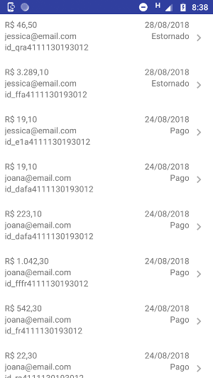

# Fintech Challenge App
The app was developed using the Wirecard REST API. The requirements for this app could be found [here](https://github.com/wirecardBrasil/challenge/tree/master/mobile) (https://github.com/wirecardBrasil/challenge/tree/master/mobile).

On this app we tried to follow the [Clean Architecture](https://8thlight.com/blog/uncle-bob/2012/08/13/the-clean-architecture.html) principles and mix with MVVM pattern. Our goal with this approach is to have a robust, maintainable and testable application.

The App is divided by the following modules:

* __App__: Contains all UI related classes (Activities, Adapters, etc.). The dependency injection is also declared in this layer.
* __Presentation__: We are following the MVVM pattern in this project. On the presentation module, you will find all the view-model classes. Those classes are responsible to manage the state of the view.
* __Domain__ : It contains the business rules of the project. For business rules, we mean the definitions of the entities and the use cases. The use cases orchestrate the flow of data to and from the entities. 
* __Data__: It defines the repository flow to access two data sources: the remote (the backend) and local (device).
* __Data Remote__: Contains the implementation of a remote data source. We are using the classical combo OkHttp+Retrofit to retrieve data from the backend.
* __Data Local__: Contains the implementation of the local data source. We are using [Hawk](https://github.com/orhanobut/hawk) to persist the user information. Hawk is a secure, simple key-value storage for Android.

## Screenshots
### Sign In


### Order List



### Order Details


## Get started

To build the Debug version on command line:

```
./gradlew app:assembleDebug
```

The signed version can be found at apk folder.
To install using ADB

```
adb install apk/app-release.apk 
```
